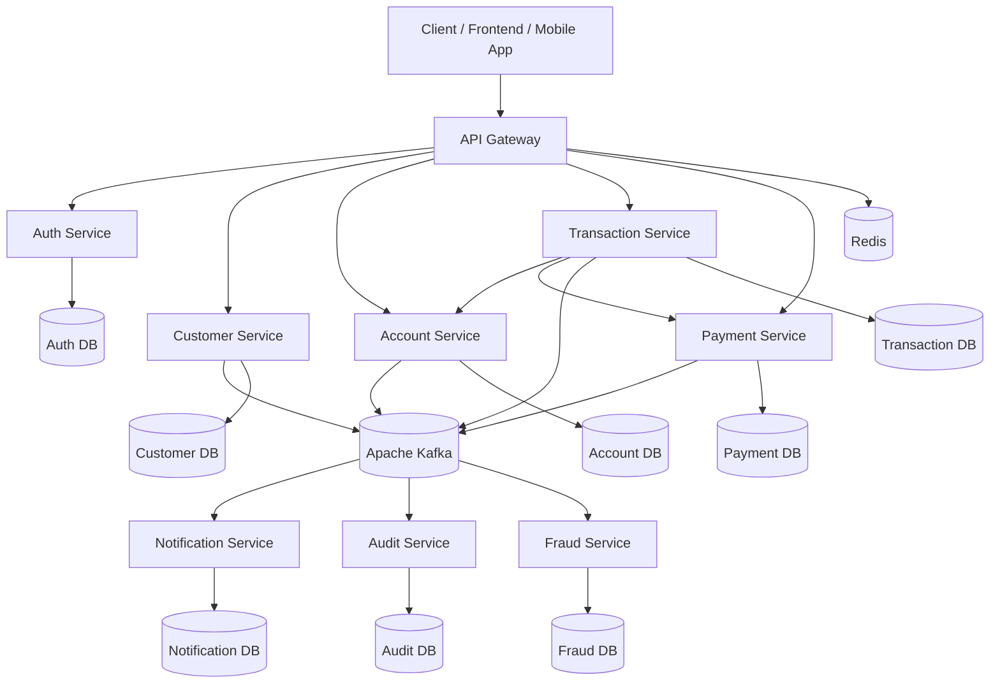
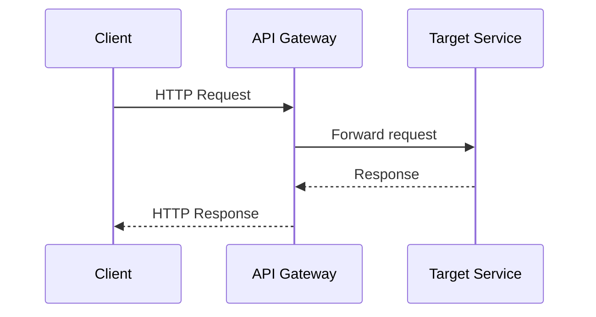
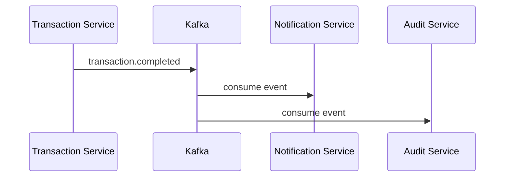
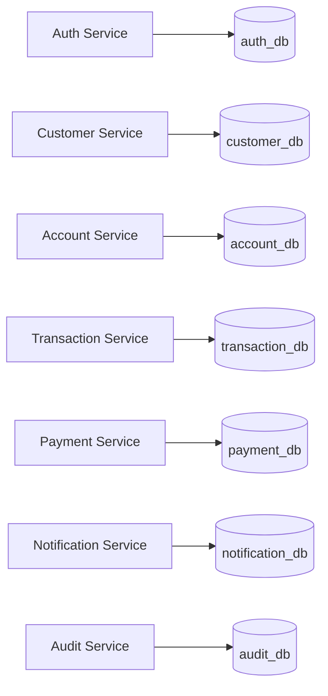
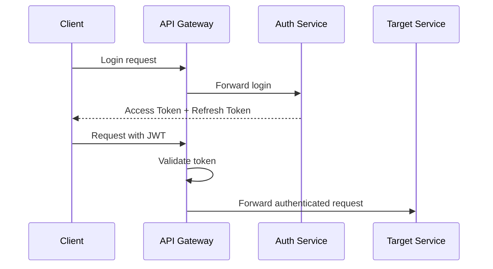
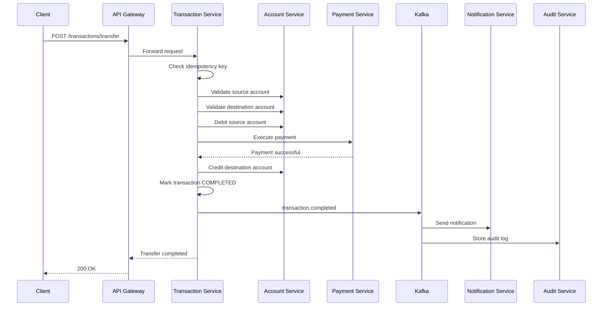
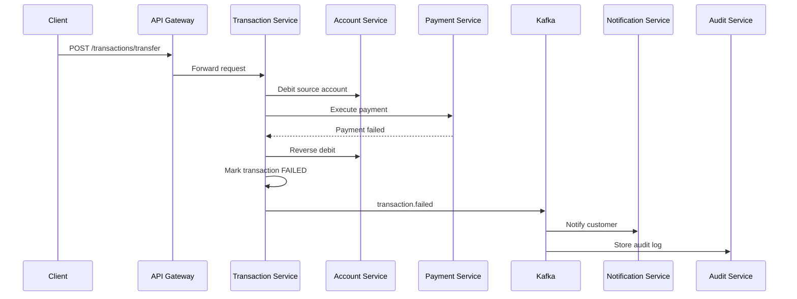

# 🏗 ARCHITECTURE.md

# Banking Core Platform Architecture

## 1. Overview

**Banking Core Platform** is designed as a microservices-based banking backend system.

The main goal of the architecture is to keep each business domain isolated, scalable, secure, and independently deployable.

The system follows these principles:

* Microservice architecture
* Domain-driven service boundaries
* Event-driven communication
* JWT-based security
* Database-per-service pattern
* Fault tolerance
* Auditability
* Idempotent transaction processing

---

## 2. High-Level Architecture



---

## 3. Service Responsibilities

## API Gateway

The API Gateway is the single entry point for external clients.

Responsibilities:

* Route requests to internal services
* Validate JWT access tokens
* Apply rate limiting
* Add correlation ID to requests
* Centralize security checks
* Hide internal service addresses

The gateway does not contain business logic.

---

## Auth Service

Responsible for authentication and token management.

Responsibilities:

* User registration
* User login
* Password hashing
* Access token generation
* Refresh token generation
* Token validation support
* Role and permission management

Security approach:

* JWT-based authentication
* No Keycloak
* Internal authentication system

---

## Customer Service

Responsible for customer profile management.

Responsibilities:

* Create customer profile
* Update customer information
* Store customer personal data
* Manage customer status
* Publish customer-related events

Example events:

* `customer.created`
* `customer.updated`
* `customer.blocked`

---

## Account Service

Responsible for bank account management.

Responsibilities:

* Create bank account
* Manage account status
* Store balance
* Validate account ownership
* Debit account
* Credit account
* Lock balance during transaction flow

Important rules:

* Balance updates must be atomic
* Optimistic locking should be used
* Account status must be checked before transaction

---

## Transaction Service

Responsible for transaction orchestration.

Responsibilities:

* Create transaction request
* Validate source and destination accounts
* Check idempotency key
* Start transfer workflow
* Manage transaction status
* Publish transaction events

Transaction statuses:

* `PENDING`
* `PROCESSING`
* `COMPLETED`
* `FAILED`
* `CANCELLED`
* `REVERSED`

This service is the main orchestrator for money movement.

---

## Payment Service

Responsible for payment execution.

Responsibilities:

* Execute payment operation
* Confirm successful payment
* Handle failed payment
* Publish payment events
* Support retry and compensation logic

Example events:

* `payment.completed`
* `payment.failed`

---

## Notification Service

Responsible for user notifications.

Responsibilities:

* Consume notification events
* Send email/SMS/push notifications
* Store notification history
* Track notification delivery status

---

## Audit Service

Responsible for audit logging.

Responsibilities:

* Consume system events
* Store audit records
* Track user actions
* Track service actions
* Store request metadata

Audit logs must be immutable.

---

## Fraud Service

Fraud Service is planned for future implementation.

Responsibilities:

* Analyze transactions
* Detect suspicious activity
* Score risk level
* Approve or reject transaction
* Publish fraud check result

---

## 4. Communication Model

The system uses two communication styles.

---

## 4.1 Synchronous Communication

Used when immediate response is required.

Technology:

* REST API
* Spring WebClient / HTTP Interface Client

Examples:

* Transaction Service checks account data
* Gateway routes request to Auth Service
* Customer Service validates user existence



---

## 4.2 Asynchronous Communication

Used for background processes and loose coupling.

Technology:

* Apache Kafka

Examples:

* Send notification after transaction completion
* Store audit log after business action
* Trigger fraud check
* Publish customer created event



---

## 5. Database Architecture

The platform follows the **database-per-service** pattern.

Each service owns its own database schema.



Rules:

* Services must not access another service database directly
* Communication between services must happen through API or events
* Schema changes are managed using Liquibase
* Each service owns its Liquibase changelog

---

## 6. Security Architecture

The system uses JWT-based security.



Security principles:

* Stateless authentication
* JWT access token
* Refresh token support
* Role-based access control
* Password hashing
* Token validation at Gateway level
* Internal services trust Gateway headers only from private network

Example roles:

* `CUSTOMER`
* `ADMIN`
* `SUPPORT`
* `AUDITOR`

---

## 7. Main Business Workflow

## Internal Money Transfer



---

## 8. Failure Handling

If payment fails, the system should compensate previous steps.



Failure principles:

* Never lose transaction state
* Always store failure reason
* Use compensation logic
* Publish failure event
* Audit every failed operation

---

## 9. Resilience Strategy

The system uses Resilience4j.

Patterns:

* Retry
* Circuit Breaker
* Timeout
* Fallback
* Bulkhead

Used for:

* Inter-service HTTP calls
* Payment execution
* External provider simulation
* Notification delivery

---

## 10. Idempotency Strategy

Payment and transaction APIs must support idempotency.

Client sends:

```http
Idempotency-Key: unique-request-key
```

System behavior:

* If key is new, process request
* If key already exists, return previous result
* Prevent duplicate payments
* Protect against network retry issues

This is critical for banking systems.

---

## 11. Observability

Every request must contain a correlation ID.

```http
X-Correlation-ID: generated-request-id
```

Used for:

* Logs
* Audit records
* Debugging
* Distributed tracing

Planned tools:

* Prometheus
* Grafana
* OpenTelemetry
* Centralized logs

---

## 12. Deployment Architecture

Local development:

```text
Docker Compose
```

Production-like future target:

```text
Kubernetes
```

Local services:

* PostgreSQL
* Kafka
* Redis
* Application services
* Prometheus/Grafana planned

---

## 13. Architecture Rules

* One service owns one database
* No direct database sharing
* Business logic stays inside service layer
* Gateway does not contain business logic
* Events must be versioned
* All database changes must go through Liquibase
* All external requests must go through API Gateway
* All critical actions must be audited
* Payment operations must be idempotent
* Transaction failures must be compensated

---

## 14. Future Improvements

* Fraud detection workflow
* Admin panel
* Reporting service
* Distributed tracing
* Kubernetes deployment
* API documentation with OpenAPI
* Centralized log management
* Outbox pattern for reliable event publishing
