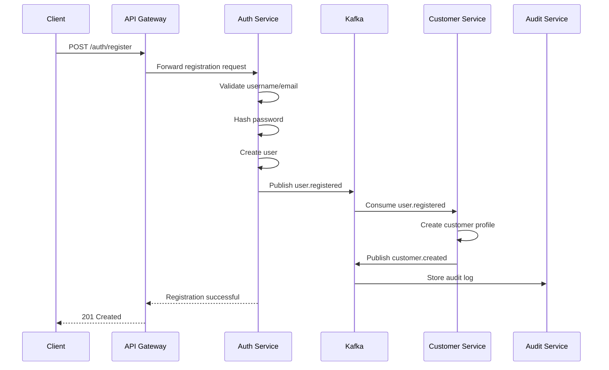
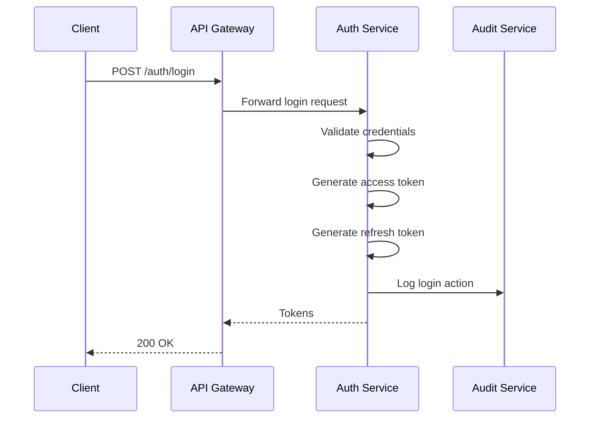
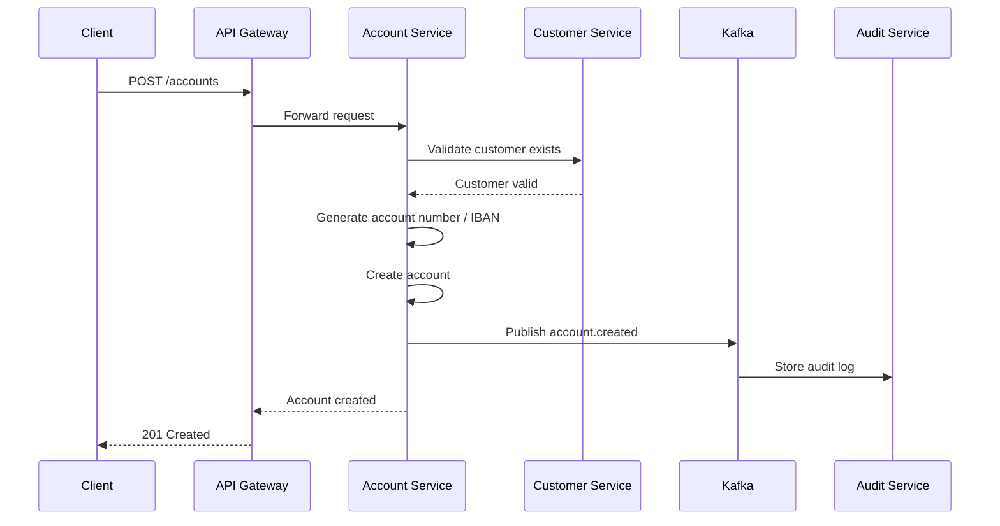
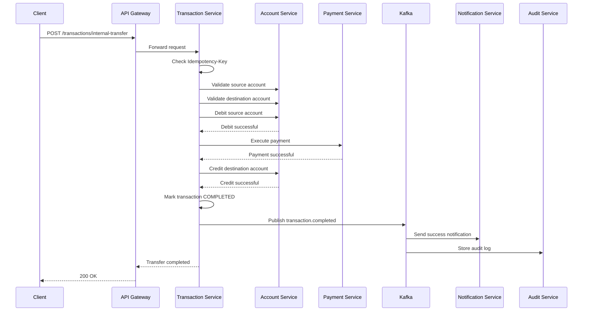
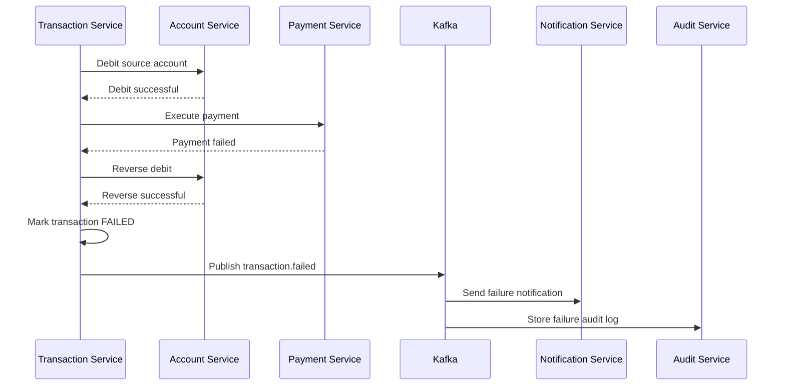
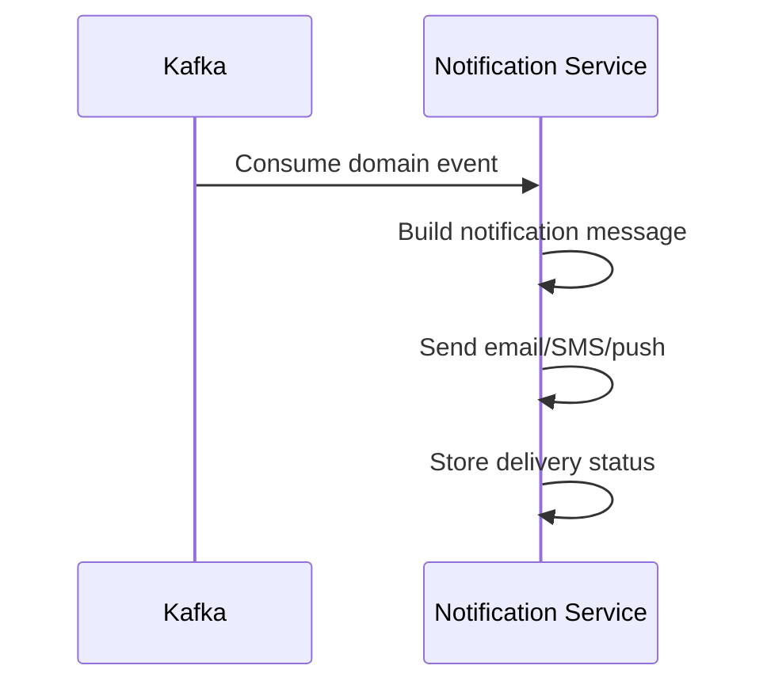
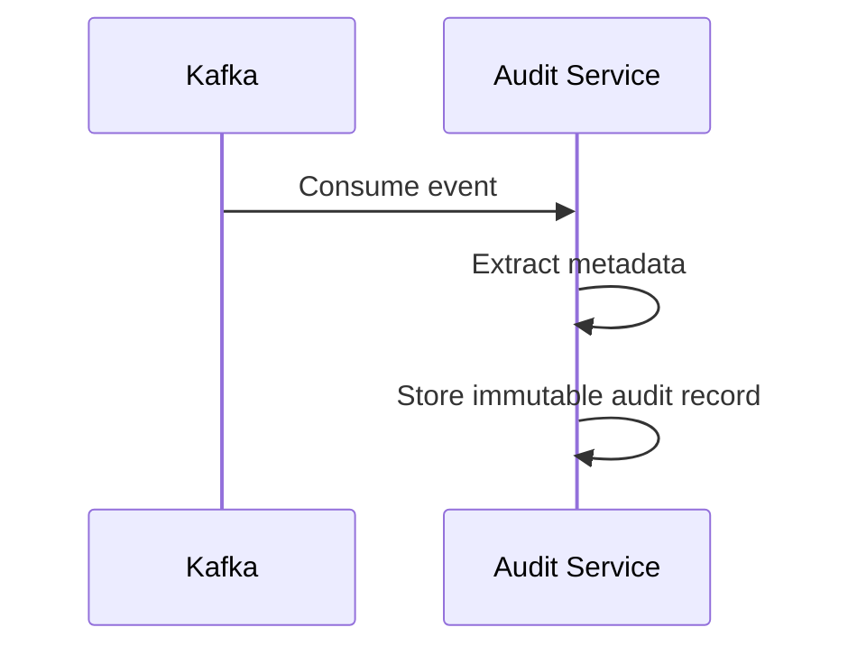
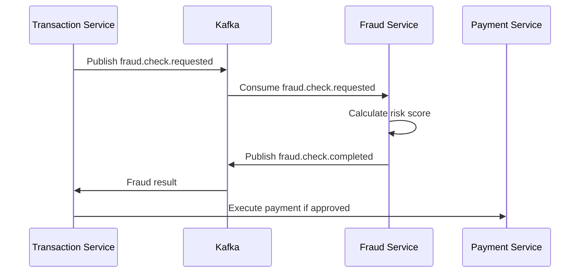
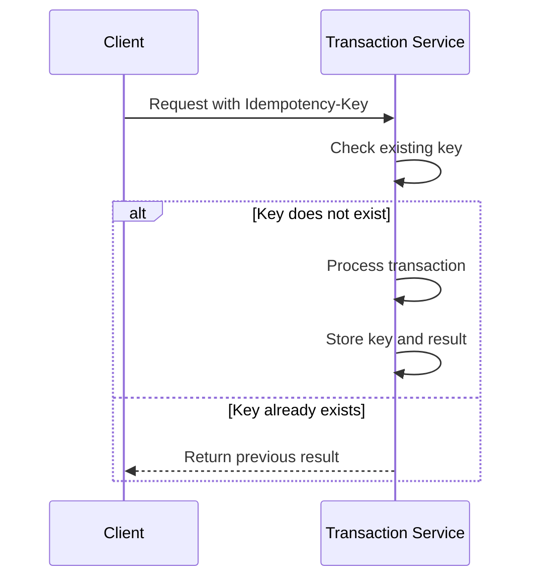
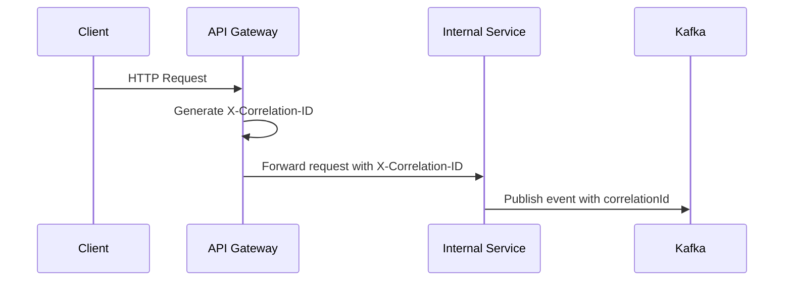

# 🔄 WORKFLOWS.md

# Banking Core Platform — Business Workflows

## 1. Overview

This document describes the main business workflows of the **Banking Core Platform**.

The goal is to define how services communicate, how business processes are executed, and how the system behaves in success and failure scenarios.

---

# 2. Customer Registration Workflow

## Description

A new user registers in the system.
Auth Service creates the user credentials, and Customer Service creates the customer profile.

## Flow



## Success Result

* User is created
* Customer profile is created
* Audit event is stored
* `user.registered` and `customer.created` events are published

## Failure Cases

| Case                            | Expected Behavior                                        |
| ------------------------------- | -------------------------------------------------------- |
| Email already exists            | Return validation error                                  |
| Password is weak                | Return validation error                                  |
| Customer profile creation fails | Store failure event and allow retry                      |
| Kafka unavailable               | Registration should fail or use outbox pattern in future |

---

# 3. User Login Workflow

## Description

User logs in and receives JWT access and refresh tokens.

## Flow



## Success Result

* Access token is generated
* Refresh token is generated
* Login action is audited

## Failure Cases

| Case                     | Expected Behavior        |
| ------------------------ | ------------------------ |
| Invalid credentials      | Return 401 Unauthorized  |
| User blocked             | Return 403 Forbidden     |
| Too many failed attempts | Temporarily lock account |

---

# 4. Account Creation Workflow

## Description

A customer opens a new bank account.

## Flow



## Success Result

* Bank account is created
* Account status is set to `ACTIVE`
* `account.created` event is published

## Failure Cases

| Case                    | Expected Behavior                                        |
| ----------------------- | -------------------------------------------------------- |
| Customer does not exist | Return 404 Not Found                                     |
| Customer is blocked     | Return 403 Forbidden                                     |
| IBAN generation fails   | Retry generation                                         |
| Account already exists  | Return conflict if business rule requires unique account |

---

# 5. Internal Transfer Workflow

## Description

Customer transfers money from one internal account to another.

This is the most important workflow in the platform.

## Flow



## Success Result

* Source account is debited
* Destination account is credited
* Transaction status becomes `COMPLETED`
* Notification is sent
* Audit log is created

## Important Business Rules

* Source and destination account must be active
* Source account must have enough available balance
* Amount must be greater than zero
* Currency must match or currency conversion must be supported
* Idempotency key is required
* Duplicate request must not create duplicate payment

## Failure Cases

| Case                               | Expected Behavior                  |
| ---------------------------------- | ---------------------------------- |
| Insufficient balance               | Transaction marked as `FAILED`     |
| Source account blocked             | Return 403 Forbidden               |
| Destination account inactive       | Return validation error            |
| Payment Service unavailable        | Retry, then fail transaction       |
| Credit operation fails after debit | Reverse debit operation            |
| Duplicate request                  | Return previous transaction result |

---

# 6. Failed Transfer Compensation Workflow

## Description

If money is debited but payment or credit operation fails, the system must compensate the previous operation.

## Flow



## Result

* Debit is reversed
* Transaction is marked as `FAILED`
* Failure reason is stored
* Customer is notified
* Audit log is created

## Critical Rule

Money must never disappear.

Either:

```text
debit + credit = completed
```

or:

```text
debit + reverse = failed safely
```

---

# 7. Notification Workflow

## Description

Notification Service sends messages after important business events.

## Events Consumed

* `customer.created`
* `account.created`
* `transaction.completed`
* `transaction.failed`
* `payment.failed`

## Flow



## Failure Cases

| Case                           | Expected Behavior              |
| ------------------------------ | ------------------------------ |
| SMS provider unavailable       | Retry                          |
| Email provider unavailable     | Retry                          |
| Notification fails permanently | Store status as `FAILED`       |
| Duplicate event consumed       | Prevent duplicate notification |

---

# 8. Audit Logging Workflow

## Description

Audit Service stores immutable logs for critical business and security events.

## Events Consumed

Audit Service should consume all important events.

Examples:

* `user.registered`
* `user.login.failed`
* `customer.created`
* `account.created`
* `transaction.created`
* `transaction.completed`
* `transaction.failed`
* `payment.failed`

## Flow



## Audit Metadata

Each audit record should contain:

```text
event_id
event_type
service_name
entity_type
entity_id
user_id
correlation_id
request_ip
payload
created_at
```

## Critical Rules

* Audit logs must be immutable
* Audit Service must not execute business logic
* Audit failure must not block main transaction flow
* Sensitive data must be masked

---

# 9. Fraud Check Workflow Planned

## Description

Fraud Service analyzes transaction risk before payment execution.

## Future Flow



## Possible Fraud Result

```text
APPROVED
REVIEW_REQUIRED
REJECTED
```

---

# 10. Idempotency Workflow

## Description

Idempotency protects the system from duplicate payments caused by retries, network issues, or repeated client requests.

## Flow



## Rules

* `Idempotency-Key` is required for payment and transfer operations
* Same key must return same result
* Same key with different payload must be rejected
* Idempotency record should have expiration policy

---

# 11. Retry and Circuit Breaker Workflow

## Description

The system uses Resilience4j to protect against temporary failures.

## Applied To

* Account Service calls
* Payment Service calls
* Notification provider calls
* External provider simulation

## Behavior

```text
Try request
If failed, retry limited number of times
If still failing, open circuit breaker
Return fallback or mark workflow as failed
```

## Rules

* Retry must not create duplicate payment
* Retry must be combined with idempotency
* Circuit Breaker should protect unstable dependencies
* Timeout must be configured for all inter-service calls

---

# 12. Correlation ID Workflow

## Description

Each request must have a correlation ID for traceability.

## Flow



## Rules

* Gateway generates correlation ID if missing
* All logs must include correlation ID
* All Kafka events must include correlation ID
* Audit records must include correlation ID

---

# 13. Workflow Design Principles

* Every critical operation must be auditable
* Money movement must be idempotent
* Balance update must be atomic
* Services must not share databases
* Events must be versioned
* Failure state must be stored
* Compensation logic must be explicit
* Notification failure must not break transaction flow
* Audit failure must not break transaction flow

---

# 14. Summary

The Banking Core Platform uses workflows that are designed around:

* Security
* Consistency
* Reliability
* Auditability
* Failure recovery
* Real banking transaction safety

The most critical rule:

> A financial transaction must never be lost, duplicated, or left in an unknown state.
